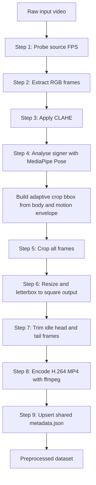
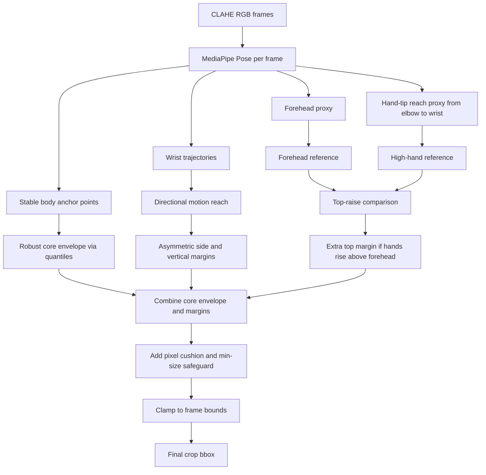
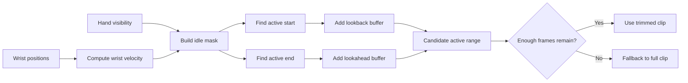
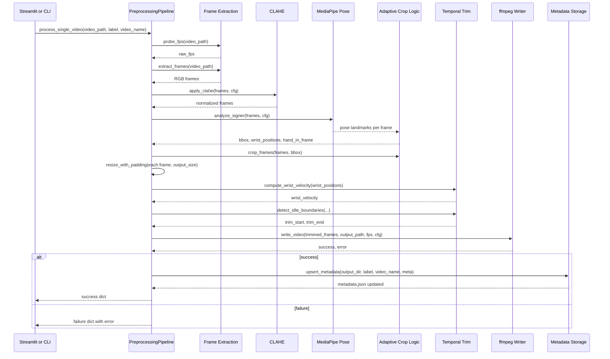

# Preprocessing Pipeline v2.0.0

## 1. Purpose

This document describes the currently implemented video preprocessing pipeline under `app/preprocessing/`.

The pipeline converts raw sign-language videos into:

1. One preprocessed MP4 per sample.
2. One shared `metadata.json` file indexing all processed samples.

The main goals are:

- standardize visual quality across heterogeneous source videos
- keep the signer centered and spatially consistent
- reduce irrelevant background while avoiding aggressive clipping
- trim idle lead-in and lead-out frames without cutting meaningful signing
- produce a simple, auditable output structure for later stages

This is the pipeline used by the preprocessing UI and CLI, and it is the canonical reference for current behavior.

Primary code entry points:

- Orchestrator: `app/preprocessing/runner.py`
- Configuration: `app/preprocessing/config.py`
- Streamlit UI: `app/views/preprocessing_page.py`
- CLI entry point: `app/preprocessing/__main__.py`

---

## 2. High-Level Flow



The important architectural point is that Step 4 does two jobs in a single MediaPipe pass:

- it computes the signer crop box
- it also collects wrist signals later reused by temporal trimming

That reuse keeps the pipeline efficient and avoids redundant model passes.

---

## 3. Inputs and Outputs

### Inputs

- Raw dataset directory, default: `dataset/raw_video_data`
- One video per sample, typically `.mp4`
- Optional label filter in CLI mode
- Runtime configuration from `PipelineConfig`

### Outputs

- Preprocessed video per sample:
  - path pattern: `outputs/preprocessed/<label>/<video_stem>.mp4`
- Global metadata file:
  - path: `outputs/preprocessed/metadata.json`

### Output guarantees

Each successfully written sample is:

- RGB-preprocessed before encoding
- cropped around the signer using the adaptive crop logic
- resized to a square canvas, default `512 x 512`
- encoded as H.264 in MP4 container
- stripped of audio

---

## 4. Processing Contract

`PreprocessingPipeline.process_single_video(...)` returns a dictionary with one of three shapes.

Success:

```python
{
    "success": True,
    "skipped": False,
    ...metadata fields...
}
```

Skipped because output video already exists:

```python
{
    "success": True,
    "skipped": True,
    "label": "...",
    "video_name": "..."
}
```

Failure:

```python
{
    "success": False,
    "label": "...",
    "video_name": "...",
    "error": "..."
}
```

---

## 5. Detailed Step-by-Step Pipeline

## Step 1. Probe source FPS

File: `app/preprocessing/frame_extraction.py`
Function: `probe_fps(...)`

### What it does

Reads source FPS from video metadata using OpenCV.

### Why it exists

The pipeline records source timing in metadata for traceability, debugging, and comparison against the output FPS.

### Input

- `video_path`

### Output

- `raw_fps: float`

### Important note

The runner currently probes FPS but does not explicitly call the ffmpeg normalization helper before extraction. `video_normalizer.py` exists, but the active orchestrator path currently decodes frames directly from the source video.

---

## Step 2. Extract frames into memory

File: `app/preprocessing/frame_extraction.py`
Function: `extract_frames(...)`

### What it does

Decodes the full video into a list of RGB frames.

### Why it exists

All later stages operate on frame arrays:

- CLAHE
- signer localization
- cropping
- resize and padding
- temporal trimming
- final encoding

### Input

- `video_path`

### Output

- `frames: list[np.ndarray]`
- each frame shape: `(H, W, 3)`
- dtype: `uint8`
- color order: RGB

---

## Step 3. CLAHE lighting normalization

File: `app/preprocessing/clahe.py`
Function: `apply_clahe(...)`

### What it does

Applies Contrast Limited Adaptive Histogram Equalization to the luminance channel of each frame.

### Why it exists

Real-world sign videos vary a lot in:

- indoor vs outdoor lighting
- contrast
- shadow strength
- camera exposure

CLAHE improves pose detection consistency by stabilizing luminance before the signer-analysis stage.

### How it works

For each frame:

1. RGB to BGR
2. BGR to LAB
3. Apply CLAHE to the `L` channel only
4. LAB back to BGR
5. BGR back to RGB

This improves contrast without heavily distorting color.

### Key config

- `clahe_clip_limit`
- `clahe_tile_size`

### Output

- same number of RGB frames
- same frame size as input to this step

---

## Step 4. Adaptive signer analysis and crop planning

File: `app/preprocessing/signer_crop.py`
Function: `analyze_signer(...)`

### What it does

Runs MediaPipe Pose over the video and returns three things:

1. an adaptive crop bounding box in original-frame pixels
2. per-frame wrist positions
3. per-frame hand visibility signal

### Why this stage matters

This is the most important spatial-normalization stage in the pipeline.

The earlier crop logic used a median body box plus global expansion. That was stable, but it could still clip the upper forehead region and, more importantly, raised fingers when the signer moved hands above the face.

The current approach is deliberately more conservative and more motion-aware.

It tries to keep:

- the signer body centered
- the forehead fully visible
- hand motion above the head still inside the crop

while avoiding a naive full-frame crop.

### MediaPipe landmarks used

The crop stage derives anchor signals from pose landmarks, especially:

- nose
- eyes
- shoulders
- elbows
- wrists
- hips

The trim signals still come from wrist positions and wrist visibility.

### Core idea of the new crop logic

The crop box is no longer just a single median body rectangle.

Instead, it is built from a robust envelope composed of:

1. stable body anchor points
2. motion points from wrists and estimated hand-tip reach
3. a forehead proxy derived from visible facial pose points
4. asymmetric side, top, and bottom margins
5. extra top margin when hand motion rises above forehead level
6. a final pixel cushion and minimum-size safeguard

### Sub-step A. Stable body anchors

Visible pose anchors are collected across frames and pooled into `anchor_points`.

These define the signer's stable core region and are used to compute a robust crop center and crop interior envelope.

The crop uses quantiles rather than raw min/max so a single noisy frame does not cause sudden overexpansion.

Relevant config:

- `crop_visibility_threshold`
- `crop_quantile_low`
- `crop_quantile_high`

### Sub-step B. Forehead proxy estimation

MediaPipe Pose does not expose a dedicated forehead landmark.

To handle this, the pipeline estimates a forehead proxy by:

1. taking the highest visible facial point among nose and eyes
2. estimating head scale from nose-to-shoulder geometry when available
3. projecting slightly upward from that facial point

This gives a lightweight but useful top-of-head reference.

Why this matters:

- it protects the upper head region from being too aggressively cropped
- it creates a meaningful reference for detecting hand-above-face motion

### Sub-step C. Estimated hand-tip reach

Pose landmarks include wrists and elbows, but not fingertips.

To avoid clipping fingers when hands rise above the head, the pipeline estimates fingertip reach by extending the elbow-to-wrist direction slightly beyond the wrist.

This produces a cheap hand-tip proxy without needing a second hand detector in preprocessing.

Relevant config:

- `crop_hand_tip_extension`

### Sub-step D. Motion envelope and asymmetric margins

The pipeline separately measures movement reach in each direction:

- left reach
- right reach
- upward reach
- downward reach

From that it computes different margins for:

- left
- right
- top
- bottom

This is better than a symmetric expansion because sign motion is often directionally biased. For example, a signer may raise hands very high without needing equally large expansion below the torso.

Relevant config:

- `crop_base_margin_side`
- `crop_base_margin_top`
- `crop_base_margin_bottom`
- `crop_motion_margin_scale`

### Sub-step E. Extra top margin for hands above forehead

This is the key safeguard added for the issue you observed.

The pipeline compares:

- a robust forehead reference over the video
- a robust high-hand reference from wrist and hand-tip motion

If the hands rise above the forehead, it increases only the top margin.

That means the crop can remain relatively tight on the sides and bottom while still leaving headroom for high hand shapes.

Relevant config:

- `crop_top_raise_scale`

### Sub-step F. Pixel cushion and minimum crop size

After the normalized margins are computed, the pipeline adds a fixed pixel cushion in both axes.

Why this is useful:

- normalized coordinates alone can still feel tight at higher resolutions
- a small absolute pixel cushion is a practical safety net against borderline clipping

Then it enforces a minimum crop width and height fraction so sparse detections cannot collapse the box into something unusably small.

Relevant config:

- `crop_cushion_px`
- `crop_min_fraction`

### Sub-step G. Legacy-compatible fallback

If adaptive signals are too sparse, the pipeline falls back to the older median-pose-box approach, then applies global expansion and clamping.

If no pose boxes are available at all, it falls back to a centered 80 percent crop.

This preserves robustness on difficult clips instead of failing hard.

### Outputs of Step 4

- `bbox: (x1, y1, x2, y2)` in original-frame pixels
- `wrist_positions: np.ndarray` of shape `(T, 4)` storing `[lx, ly, rx, ry]`
- `hand_in_frame: np.ndarray` of shape `(T,)`

### Crop analysis diagram



---

## Step 5. Crop to signer region

File: `app/preprocessing/signer_crop.py`
Function: `crop_frames(...)`

### What it does

Crops every frame to the computed bounding box.

### Why it exists

Once the adaptive crop box has been chosen, the actual crop stage is intentionally simple and deterministic.

This separation is useful because:

- crop planning is where complexity belongs
- the crop application itself should remain stable and easy to audit

### How it works

Each frame is sliced as:

```python
frame[y1:y2, x1:x2]
```

### Output

- cropped frame list
- runner records the crop dimensions in metadata as `crop_size`

---

## Step 6. Resize and letterbox to fixed square output

File: `app/preprocessing/video_writer.py`
Function: `resize_with_padding(...)`

### What it does

Converts each cropped frame to a square output resolution without aspect-ratio distortion.

### Why it exists

Sign videos should keep body geometry intact. Stretching hands, arms, or torso would corrupt downstream motion interpretation.

### How it works

For each cropped frame:

1. scale so the longer side becomes `output_size`
2. resize with `cv2.INTER_AREA`
3. place the resized frame at the center of a black square canvas

### Output

- exact frame shape: `(output_size, output_size, 3)`

### Key config

- `output_size`

---

## Step 7. Temporal trimming with dual signal

Files:

- `app/preprocessing/temporal_trim.py`
- functions: `compute_wrist_velocity(...)`, `detect_idle_boundaries(...)`

### What it does

Removes likely idle frames at the start and end of the clip.

### Why it exists

Raw videos often include:

- pre-sign neutral posture
- post-sign settling motion
- hands outside the frame before signing begins

These frames add noise without helping recognition.

### Signals used

Signal A: hand visibility

- derived from wrist landmark visibility
- detects cases where hands are out of view

Signal B: wrist velocity

- computed as max displacement of left/right wrist relative to previous frame
- detects visible but idle hands

### Idle definition

A frame is considered idle if:

- no hand is visible, or
- wrist velocity is below threshold

### Boundary detection strategy

1. build idle mask
2. scan from the front to find the first confirmed active region
3. scan from the back to find the last confirmed active region
4. require short active runs for confirmation to avoid reacting to single-frame noise
5. add a small lookback and lookahead buffer
6. if too few frames remain, keep the full original range

### Output

- `trim_start`
- `trim_end`
- trimmed frame list in runner

### Key config

- `trim_vel_threshold`
- `trim_min_idle_duration`
- `min_active_frames`

### Temporal trim diagram



---

## Step 8. Write output MP4

File: `app/preprocessing/video_writer.py`
Function: `write_video(...)`

### What it does

Streams RGB frames directly to ffmpeg stdin and writes an H.264 MP4.

### Why it exists

This avoids temporary image dumps and keeps encoding efficient.

### Encoding behavior

- raw input format to ffmpeg: `rgb24`
- video codec: `libx264`
- pixel format: `yuv420p`
- audio: removed
- file container: MP4

### Validation after writing

The writer checks:

- ffmpeg exit code
- output file existence
- non-zero file size

### Key config

- `target_fps`
- `crf_quality`
- `ffmpeg_preset`

### Output path

- `outputs/preprocessed/<label>/<video_stem>.mp4`

---

## Step 9. Upsert shared metadata

File: `app/preprocessing/storage.py`
Function: `upsert_metadata(...)`

### What it does

Writes per-video processing metadata into one shared JSON file.

### Why it exists

A single metadata index is easier to:

- inspect
- compare
- report on
- reuse for future dataset analysis

than many tiny per-sample metadata files.

### Storage layout

```json
{
  "label": {
    "video_stem": {
      "...": "..."
    }
  }
}
```

If the same sample is reprocessed, its metadata entry is overwritten intentionally.

---

## 6. Current Metadata Schema

The runner currently writes the following fields for each processed sample:

- `source_video`
- `label`
- `raw_fps`
- `output_fps`
- `original_frame_count`
- `trimmed_frame_count`
- `trim_range`
- `crop_bbox`
- `crop_size`
- `output_size`
- `pipeline_version`
- `processing_timestamp`

Example:

```json
{
  "who": {
    "who_63229": {
      "source_video": "who_63229.mp4",
      "label": "who",
      "raw_fps": 23.976,
      "output_fps": 30,
      "original_frame_count": 47,
      "trimmed_frame_count": 45,
      "trim_range": [2, 46],
      "crop_bbox": [421, 0, 1709, 1080],
      "crop_size": [1288, 1080],
      "output_size": [512, 512],
      "pipeline_version": "2.0.0",
      "processing_timestamp": "2026-03-17T09:23:51.617877+00:00"
    }
  }
}
```

Interpretation:

- `crop_bbox` is in original-frame pixels: `[x1, y1, x2, y2]`
- `crop_size` is `[width, height]` after crop and before resize+letterbox
- `trim_range` is inclusive in original extracted-frame indexing

---

## 7. Configuration Surface

The main preprocessing knobs live in `PipelineConfig`.

### Video normalization and encoding

- `target_fps`
- `crf_quality`
- `ffmpeg_preset`

### CLAHE

- `clahe_clip_limit`
- `clahe_tile_size`

### Adaptive signer crop

- `crop_expansion`
- `crop_visibility_threshold`
- `crop_quantile_low`
- `crop_quantile_high`
- `crop_base_margin_side`
- `crop_base_margin_top`
- `crop_base_margin_bottom`
- `crop_motion_margin_scale`
- `crop_top_raise_scale`
- `crop_hand_tip_extension`
- `crop_cushion_px`
- `crop_min_fraction`

### Output resolution

- `output_size`

### Temporal trimming

- `trim_vel_threshold`
- `trim_min_idle_duration`
- `min_active_frames`

### Device

- `device`

---

## 8. Streamlit UI Controls

The preprocessing page exposes the most important user-facing settings.

Current crop-related controls include:

- Bbox expansion
- Safety cushion (px)
- Hand reach extension

These UI controls intentionally expose only the most useful high-level tuning knobs. The lower-level adaptive crop parameters stay in `PipelineConfig` so the code remains configurable without overwhelming the UI.

---

## 9. Output Layout

### Directory structure

```text
outputs/
  preprocessed/
    metadata.json
    brother/
      brother_07932.mp4
    who/
      who_63229.mp4
      who_63230.mp4
    yes/
      yes_12345.mp4
```

### File formats

Processed sample video:

- container: MP4
- codec: H.264
- pixel format: `yuv420p`
- audio: none
- resolution: fixed square, default `512 x 512`

Metadata:

- UTF-8 JSON
- one global dictionary keyed by label and video stem

---

## 10. Quality Checks and Reporting

File: `app/preprocessing/quality_checks.py`

The quality-check stage validates written outputs after processing.

### `check_sample(...)`

Checks that:

1. the output MP4 exists
2. OpenCV can open it
3. the frame count is at least the minimum threshold

### `generate_dataset_report(...)`

Loads `metadata.json`, checks each listed sample, and returns `SampleReport` objects.

Each report contains:

- `label`
- `video_name`
- `passed`
- `warnings`
- `trimmed_frames`
- `output_frames`

---

## 11. CLI and Batch Operation

CLI entry point:

```text
python -m app.preprocessing
```

Common flags:

- `--dataset-dir`
- `--output-dir`
- `--output-size`
- `--target-fps`
- `--clahe-clip`
- `--label`
- `--no-skip-existing`
- `--report`
- `--verbose`

Batch summary fields:

- `total`
- `processed`
- `skipped`
- `failed`
- `trimmed_count`

---

## 12. Design Rationale

The current pipeline is intentionally pragmatic.

### Why CLAHE is before crop

Pose quality benefits from seeing a lighting-normalized full frame before localization decisions are made.

### Why the crop is motion-aware instead of purely body-box based

Sign videos are not just torso-centered gesture clips. Important hand shapes often occur:

- beside the head
- at forehead level
- above the head

So a good signer crop must represent both body anchors and motion envelope.

### Why the crop is asymmetric

Sign motion is not symmetric. Giving equal margin everywhere wastes pixels in low-value regions while still risking clipping in high-motion regions.

### Why the forehead proxy is necessary

The bug you observed was not really about preserving the head for its own sake. It was about preserving the vertical space where raised fingers and hand shapes appear. The forehead proxy gives the crop logic a stable visual reference for deciding how much headroom to keep.

### Why hand-tip reach is estimated from elbow and wrist

The preprocessing pipeline already uses MediaPipe Pose. Estimating fingertip reach from forearm direction is a cheap, robust approximation that improves crop safety without requiring a second detector pass.

### Why robust quantiles are preferred over min/max

Raw min/max over all detections is too sensitive to occasional landmark noise. Quantiles preserve most of the real motion range while suppressing outlier expansion.

---

## 13. Caveats and Current Limitations

1. The active runner path currently probes source FPS but does not explicitly normalize source videos before extraction.
2. Temporal trim converts duration to frames using `cfg.target_fps`, which is a practical approximation when source FPS differs.
3. Forehead is estimated indirectly because Pose does not provide a dedicated forehead landmark.
4. Finger reach is approximated from elbow-to-wrist direction, not measured directly from a hand detector.
5. Metadata entries are overwritten on reprocessing by design.

These tradeoffs are intentional and keep the pipeline stable, efficient, and easy to operate.

---

## 14. Sequence Diagram



---

## 15. Minimal API Reference

Canonical public surface for the preprocessing pipeline:

- `PipelineConfig` in `app/preprocessing/config.py`
- `PreprocessingPipeline.process_single_video(...)` in `app/preprocessing/runner.py`
- `PreprocessingPipeline.run(...)` in `app/preprocessing/runner.py`
- `generate_dataset_report(...)` in `app/preprocessing/quality_checks.py`

This document should be treated as the authoritative description of current preprocessing behavior unless the implementation changes again.
